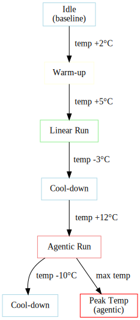

# Understanding Metrics

This guide explains all the metrics collected by A-LEMS and what they mean for your research.

---

## 📊 Core Energy Metrics

### Energy Measurements

| Metric | Unit | Description |
|--------|------|-------------|
| `pkg_energy_uj` | µJ | Total package energy (raw) |
| `core_energy_uj` | µJ | Core energy (raw) |
| `uncore_energy_uj` | µJ | Uncore energy (cache, memory controller, I/O) |
| `dram_energy_uj` | µJ | DRAM energy (if available) |
| `total_energy_uj` | µJ | Raw package energy |
| `dynamic_energy_uj` | µJ | Workload energy (raw - idle) |
| `baseline_energy_uj` | µJ | Idle energy for same duration |

### Derived Energy Metrics

| Metric | Formula | Meaning |
|--------|---------|---------|
| `workload_energy` | `package - idle` | Energy actually used by your workload |
| `reasoning_energy` | `core - idle_core` | Energy for actual computation |
| `orchestration_tax` | `workload - reasoning` | Overhead of agentic orchestration |
| `energy_per_token` | `workload / tokens` | Energy efficiency per token |
| `energy_per_instruction` | `workload / instructions` | Energy per CPU instruction |

---

## 🎯 Orchestration Tax

The orchestration tax is A-LEMS's core metric:

```
tax = agentic_energy / linear_energy
tax_percent = (agentic - linear) / agentic * 100
```

**Interpretation:**

| Tax Value | Meaning |
|-----------|---------|
| 1.0x | No overhead (rare) |
| 1.5x | 50% more energy |
| 2.0x | 2× more energy |
| 5.0x+ | High orchestration overhead |

**Example from real data:**

```
Linear: 1.2 J
Agentic: 2.6 J
Tax: 2.2x (120% more energy)
```

---

## ⚡ Power Metrics

| Metric | Unit | Description |
|--------|------|-------------|
| `avg_power_watts` | W | Average power during run |
| `package_power` | W | Instantaneous package power |
| `core_power` | W | Instantaneous core power |
| `dram_power` | W | DRAM power (if available) |

**Power curves** from `energy_samples` show how power changes over time:

```
Power (W)
25 ├─────────────────────•────
20 │ •───•
15 │ •──•
10 │ •──•
5  │ •──•
0  └────•────•────•────•────•────•
    0   2   4   6   8   10 Time (s)
```

---

## 💻 Performance Counters

| Metric | Description | Good Value |
|--------|-------------|------------|
| `ipc` | Instructions Per Cycle | > 2.0 |
| `cache_miss_rate` | LLC cache miss rate | < 5% |
| `instructions` | Total instructions executed | N/A |
| `cycles` | Total CPU cycles | N/A |
| `page_faults` | Memory page faults | Low |

**IPC (Instructions Per Cycle)** indicates how efficiently the CPU is used:

- **< 1.0**: Memory-bound or stalled
- **1.0 - 2.0**: Mixed workload
- **> 2.0**: Compute-bound, efficient

---

## ⏱️ Timing Metrics

| Metric | Unit | Description |
|--------|------|-------------|
| `duration_ns` | ns | Total run duration |
| `planning_time_ms` | ms | Planning phase (agentic only) |
| `execution_time_ms` | ms | Tool execution phase |
| `synthesis_time_ms` | ms | Response synthesis phase |
| `api_latency_ms` | ms | Time waiting for API |
| `compute_time_ms` | ms | Actual computation time |
| `waiting_time_ms` | ms | Time between LLM calls |

**Phase ratios for agentic workflows:**

```
Planning: 2.3s (30%)
Execution: 4.1s (54%)
Synthesis: 1.2s (16%)
Total: 7.6s
```

---

## 🌡️ Thermal Metrics

| Metric | Unit | Description |
|--------|------|-------------|
| `package_temp_celsius` | °C | CPU package temperature |
| `start_temp_c` | °C | Temperature at run start |
| `max_temp_c` | °C | Peak temperature |
| `thermal_delta_c` | °C | Temperature rise (max - start) |
| `thermal_gradient` | °C/s | Rate of temperature change |

**Thermal thresholds:**

- **< 60°C**: Normal operation
- **60-80°C**: Warm, still efficient
- **80-95°C**: Hot, possible throttling
- **> 95°C**: Thermal throttling active

### Thermal Profile Example



---

## 🔄 C-State Metrics

| Metric | Description | Power Savings |
|--------|-------------|---------------|
| `c2_time_seconds` | Time in C2 (light sleep) | Moderate |
| `c3_time_seconds` | Time in C3 (deeper sleep) | High |
| `c6_time_seconds` | Time in C6 (very deep) | Very high |
| `c7_time_seconds` | Time in C7 (package sleep) | Maximum |

**C-state residency** shows how efficiently the CPU enters low-power states during idle periods.

---

## 📊 Scheduler Metrics

| Metric | Description | High Value Indicates |
|--------|-------------|----------------------|
| `context_switches_voluntary` | Thread yielding | Normal operation |
| `context_switches_involuntary` | Forced preemption | Contention |
| `thread_migrations` | CPU hopping | Poor cache locality |
| `run_queue_length` | Runnable processes | System load |
| `interrupt_rate` | Interrupts per second | I/O activity |

---

## 🧠 Agentic Metrics

| Metric | Description | Typical Range |
|--------|-------------|---------------|
| `llm_calls` | Number of LLM invocations | 1-10 |
| `tool_calls` | Number of tool executions | 0-5 |
| `steps` | Total workflow steps | 1-15 |
| `complexity_level` | 1-3 scale | Task difficulty |
| `complexity_score` | 1-10 scale | Normalized complexity |

---

## 🌍 Sustainability Metrics

| Metric | Unit | Description |
|--------|------|-------------|
| `carbon_g` | g CO₂ | Carbon footprint |
| `water_ml` | ml | Water consumption |
| `methane_mg` | mg | Methane emissions |

**Country-specific factors** are applied based on grid intensity:

| Country | Carbon (g/kWh) | Water (ml/kWh) |
|---------|----------------|----------------|
| US | 0.389 | 2.1 |
| IN | 0.708 | 3.4 |
| FR | 0.055 | 1.2 |
| CN | 0.555 | 2.8 |

---

## 📈 Efficiency Metrics

| Metric | Formula | Good Value |
|--------|---------|------------|
| Energy per token | `workload / tokens` | < 0.01 J/token |
| Energy per instruction | `workload / instructions` | < 1e-9 J/inst |
| Instructions per token | `instructions / tokens` | > 1000 |
| Interrupts per second | `interrupt_rate` | < 5000 |

---

## 🔍 Sample Queries

### Get All Metrics for a Run

```sql
SELECT * FROM runs WHERE run_id = 977;
```

### Compare Linear vs Agentic

```sql
SELECT 
    r.workflow_type,
    AVG(r.dynamic_energy_uj/1e6) as avg_energy_j,
    AVG(r.duration_ns/1e9) as avg_duration_s,
    AVG(r.ipc) as avg_ipc
FROM runs r
WHERE r.exp_id = 185
GROUP BY r.workflow_type;
```

### Find High Tax Experiments

```sql
SELECT 
    e.exp_id,
    e.task_name,
    ots.tax_percent
FROM orchestration_tax_summary ots
JOIN runs r ON ots.linear_run_id = r.run_id
JOIN experiments e ON r.exp_id = e.exp_id
WHERE ots.tax_percent > 200
ORDER BY ots.tax_percent DESC;
```

---

## 📊 Metric Categories Summary

| Category | Key Metrics | Use For |
|----------|-------------|---------|
| **Energy** | workload, reasoning, tax | Core research |
| **Performance** | ipc, cache_miss_rate | CPU efficiency |
| **Timing** | phase times, latency | Bottleneck analysis |
| **Thermal** | temperature, delta | Cooling analysis |
| **C-State** | residency times | Power management |
| **Scheduler** | context switches | OS overhead |
| **Agentic** | llm_calls, steps | Workflow complexity |
| **Sustainability** | carbon, water | Environmental impact |

---

## ✅ Next Steps

- [Run experiments](01-running.md)
- [View metrics in GUI](04-gui-usage.md)
- [Generate reports](05-generating-reports.md)